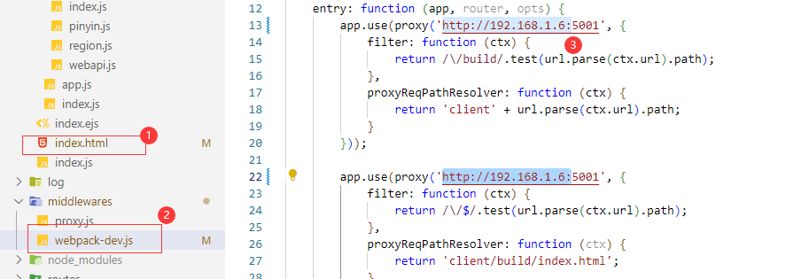

## Build your dream

### 服务器Aliyun

环境准备

```
106.15.89.47 root/P******tgU6R2LdU@M9EqZ
sudo apt update
sudo apt install postgresql postgresql-contrib
sudo systemctl start postgresql.service

 sudo apt-get install \
    ca-certificates \
    curl \
    gnupg \
    lsb-release


curl -fsSL test.docker.com -o get-docker.sh && sh get-docker.sh
usermod -aG docker $USER
sudo curl -L "https://github.com/docker/compose/releases/download/1.29.2/docker-compose-$(uname -s)-$(uname -m)" -o /usr/local/bin/docker-compose

sudo chmod +x /usr/local/bin/docker-compose
docker-compose --version

apt install nginx
```


构建发布到aliyun容器仓库

```
# 拉取
$ docker login --username=yww3571373 registry.cn-hangzhou.aliyuncs.com
$ docker pull registry.cn-hangzhou.aliyuncs.com/yinweiwen/public:[镜像版本号]

# 推送镜像
$ docker login --username=yww3571373 --password=${{secrets.ALI_DOCKER_CREDENTIALS }} registry.cn-hangzhou.aliyuncs.com
$ docker tag [ImageId] registry.cn-hangzhou.aliyuncs.com/yinweiwen/public:[镜像版本号]
$ docker push registry.cn-hangzhou.aliyuncs.com/yinweiwen/public:[镜像版本号]
```


Github自动集成（workflow）

```xml
name: Docker Image CI

on:
  push:
    branches: [ master ]
  pull_request:
    branches: [ master ]

jobs:

  build:

    runs-on: ubuntu-latest

    steps:
    - uses: actions/checkout@v3
    - name: Setup Node.js environment
      uses: actions/setup-node@v3.2.0
      with:
        # Version Spec of the version to use. Examples: 12.x, 10.15.1, >=10.15.0.
        node-version: v16.14.2
    - name: compile
      run: cd api && unzip -o node_modules.zip && npm install
    - name: compile web
      run: cd web && unzip -o node_modules.zip && npm install --legacy-peer-deps
    - name: docker login
      run: docker login --username=yww3571373 --password=${{ secrets.ALI_DOCKER_CREDENTIALS }} registry.cn-hangzhou.aliyuncs.com
    - name: gen version
      id: version
      run: echo "::set-output name=number::$(date +%s)"
    - name: Build the Docker API
      run: cd api && docker build . --file Dockerfile --tag registry.cn-hangzhou.aliyuncs.com/yinweiwen/github:demoapi-${{ steps.version.outputs.number }}
    - name: Build the Docker WEB
      run: cd web && docker build . --file Dockerfile --tag registry.cn-hangzhou.aliyuncs.com/yinweiwen/github:demoweb-${{ steps.version.outputs.number }}
    - name: publish API
      run: docker push registry.cn-hangzhou.aliyuncs.com/yinweiwen/github:demoapi-${{ steps.version.outputs.number }}
    - name: publish WEB
      run: docker push registry.cn-hangzhou.aliyuncs.com/yinweiwen/github:demoweb-${{ steps.version.outputs.number }}
```


run with docker-compose

```yml
# Please see the README.md for instructions as to how to use and customize.

# NOTE: This file does not build! No dockerfiles are set. See the README.md in this directory.
---
version: '3.8'
services:

  redis:
    image: redis
    hostname : redis
    container_name: redis
    restart: always
    ports:
      - "6379:6379"
    volumes:
      - redisdata:/data
      
  db:
    image: postgres
    hostname : pg
    restart: always
    environment:
      POSTGRES_PASSWORD: 123
    ports:
      - "5432:5432"
    volumes:
      - pgdata:/var/lib/postgresql/data
      
  web:
    image: registry.cn-hangzhou.aliyuncs.com/yinweiwen/public/demoweb:latest
    hostname : web
    restart: always
    environment:
      FS_UNIAPP_API: http://api:14000
    ports:
      - "8080:8080"
    depends_on:
      - api
      
  api:
    image: registry.cn-hangzhou.aliyuncs.com/yinweiwen/public/demoapi:latest
    hostname : api
    restart: always
    command: node server.js -p 14000
    environment:
      FS_UNIAPP_DB: postgres://postgres:123@pg:5432/demo
      FS_UNIAPP_FC_LOCAL_SVR_ORIGIN: http://localhost:14000
    ports:
      - "14000:14000"


networks:
  default:
    name: default_network

volumes:
  pgdata:
  redisdata:

```


通过nginx反向代理实现网站和api的跨域访问

```nginx
server {
        listen 80;
        return 301 https://$host$request_uri;
        server_name yinweiwen.cn;
        client_max_body_size 10M;

    location /_api {
        proxy_pass  http://localhost:14000;
        proxy_cookie_domain localhost localhost;
        proxy_cookie_path / /;
        proxy_connect_timeout 1;
        proxy_send_timeout 120;
        proxy_read_timeout 300;
        proxy_set_header X-Real-Ip $remote_addr;
        proxy_set_header X-Forwarded-For $proxy_add_x_forwarded_for;
    }

    location / {
        proxy_pass    http://localhost:8080;
        proxy_cookie_domain localhost localhost;
        proxy_cookie_path / /;
        proxy_connect_timeout 1;
        proxy_send_timeout 600;
        proxy_read_timeout 60;
    }
}
```


### 调试手机


